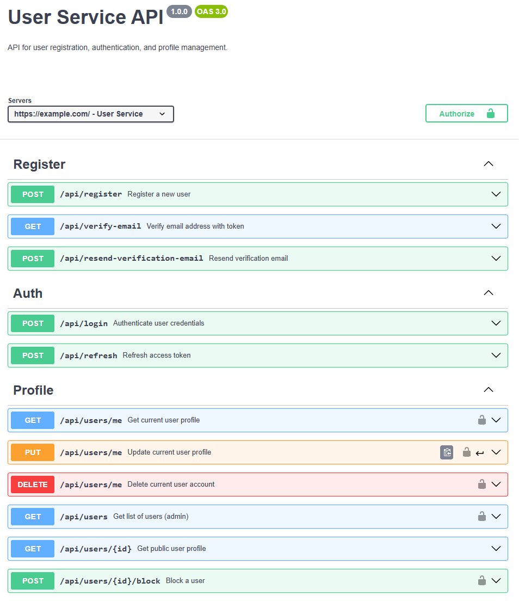
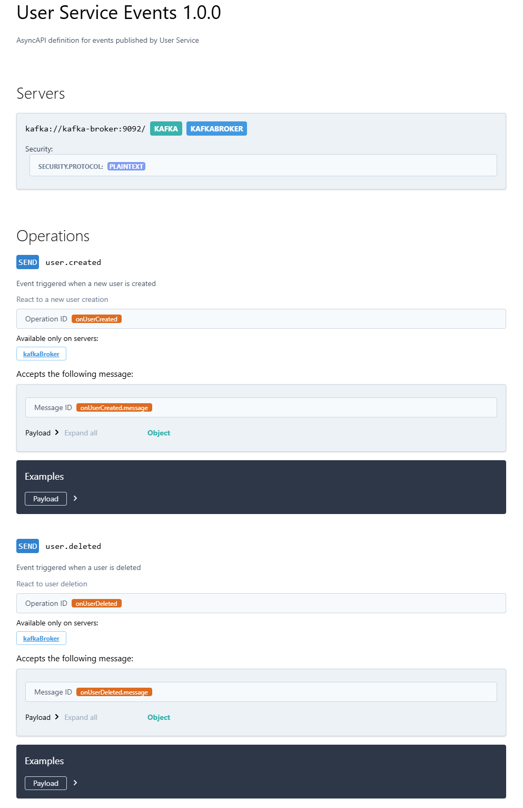
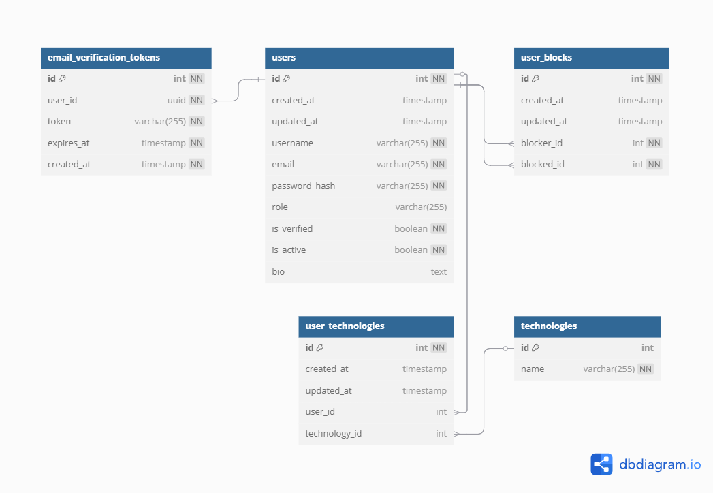

# Web application for finding teams and projects

Online web application that helps people find like-minded collaborators for informal projects, pet projects, or skill-practice collaborations.

---

## Roles
- **Guest** — a user who is not registered and wants to register
- **User** — a registered user who has a idea for a project and looks for team members or is looking for a project to join
- **Admin** — system Administrator who manages users and projects

---

## Functional Requirements (User Stories)

### 1. Registration and Authentication

- As a **Guest**, I want to be able to register using my email and password.
- As a **User**, I want to be able to verify my email address by following a link sent to my email
- As a **User**, I want to be able to request a new verification email.
- As a **User**, I want to be able to log in with valid credentials.
- As a **User**, I want to be able to stay authenticated.

### 2. Project Creation and Management

- As a **User**, I want to be able to create a project to search for team members.
- As a **User**, I want to be able to view my project details.
- As a **User**, I want to be able to edit my project details.
- As a **User**, I want to be able to delete my project.
- As a **User**, I want to be able to view all my projects.

### 3. Team Seeking and Management

- As a **User**, I want to be able to browse a list of open projects.
- As a **User**, I want to be able to filter projects.
- As a **User**, I want to be able to search for projects using keywords in the title or description.
- As a **User**, I want to be able to view project details.

### 4. User Management

- As a **User**, I want to be able to view my profile.
- As a **User**, I want to be able to edit my profile.
- As a **User**, I want to specify and update my technology stack as part of my profile.
- As a **User**, I want to be able to delete my account.
- As a **User**, I want to be able to view other users profiles.
- As a **User**, I want to be able to block other users.
- As a **User**, I want to be able to report other users.

### 5. Communication and Requests

- As a **User**, I want to be able to send a request to join a project.
- As a **User**, I want to be able to accept or reject a request to join a project.
- As a **User**, I want to be able to communicate with other users to discuss project details.
- As a **User**, I want to be able to see chat messages in real-time.
- As a **User**, I want to be able to access previous conversations linked to the project.
- As a **User**, I want to be able to view all requests to join my project.
- As a **User**, I want to be able to view all my requests to join projects.
- As a **User**, I want to be able to view status of my requests to join projects.

### 6. Notifications

- As a **User**, I want to be able to receive notifications when someone applies to my project.
- As a **User**, I want to be able to receive notifications when my request to join a project is accepted or rejected.

### 7. Admin Management

- As an **Admin**, I want to be able to view all users.
- As an **Admin**, I want to be able to view all projects.
- As an **Admin**, I want to be able to view all requests to join projects.
- As an **Admin**, I want to be able to view all chat messages.
- As an **Admin**, I want to be able to view all reports about inappropriate projects.
- As an **Admin**, I want to be able to view all reports about inappropriate users.
- As an **Admin**, I want to be able to block users who violate rules.
- As an **Admin**, I want to be able to delete or hide inappropriate projects.

## Quality Requirements (Grouped by Quality Attributes)

### 1. Usability

- The system should have an intuitive user interface accessible to non-technical users.
- Registration and onboarding should take no longer than 2 minutes for a new user.

### 2. Security

- The system must protect against common web attacks (XSS, CSRF, SQL injection).
- Passwords must be stored securely using hashing algorithms.
- The system must implement secure user authentication using JWT tokens.

### 3. Performance
- System should load the main dashboard within 1.5 seconds
- Search and filtering operations should return results within 2 seconds.

### 4. Reliability

- The system should be available 95% of the time.
- Chat, requests, and data operations must never result in data loss.

### 5. Maintainability

- The codebase should follow clean architecture principles.
- System should include clean API documentation.

### 6. Portability

- The system must be a web-based application accessible via browsers.
- The frontend must be compatible with recent versions of major browsers.

---

## User Service

The User Service is responsible for managing user-related operations and data. It handles user registration, authentication, profile management, and user-related administrative functions.

### User Service API Documentation

#### REST API (OpenAPI)

[View full OpenAPI Documentation](./UserService/openapi.yaml)

#### Event-Driven API (AsyncAPI)

[View full AsyncAPI Documentation](./UserService/asyncapi.yaml)

### Database Schema

[View interactive ERD](https://dbdiagram.io/d/User-Service-ERD-672fab1ee9daa85acae376f0)
